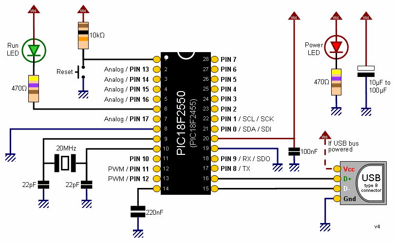
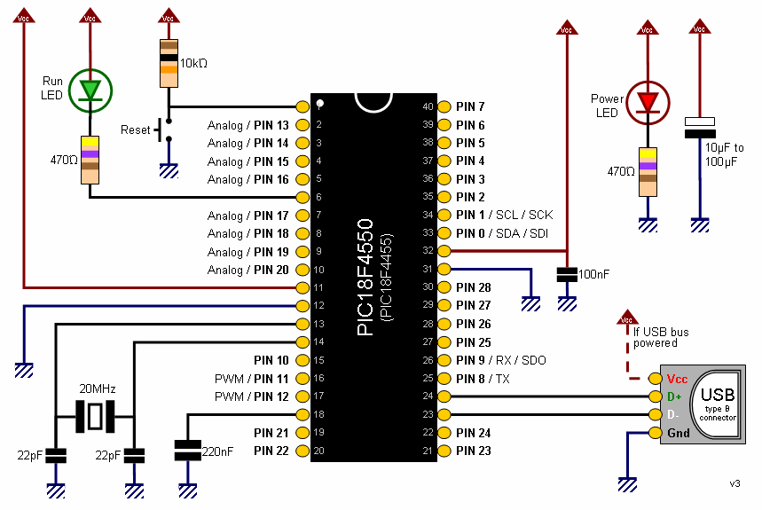

# Vista general #

## Universal Serial Bus (USB):  ##

* Satisface la Espeficicacion USB 2.0.
* Baja Velocidad (1.5 Mb/s) y Alta Velocidad (12 Mb/s).
* Controlador USB integrado.
* No requiere programador, todo el codigo pasar por el puerto USB directamente al Microcontrolador.
* Soporta Comunicación CDC.

## Perifericos ##
* Corriente de Salida: 25mA.
* 3 Interrupciones Externas
* 4 Modulos Timer (Timer0 - Timer3).
* 2 Modulos de Comparación/PWM (CPP).
 * Resolución Modulo de Comparación: 16bits.
 * Resolucion Modulo de PWM 10 bits.
* Puerto USART.
* Puerto I2C.
* 8 Canales Analogicos (10 bits).

## Funciones Especiales ##
* Maximo de Programaciones del MicroControlador: 100.000
* Hasta 1.000.000 de Ciclos de Lectura escritura en la Memoria EEPROM.
* Retencion mayor a 40 años Memoria EEPROM.
* Programación en Circuito.

## Datos ##
| Pinguino | Memoria Flash |     SRAM     | EEPROM (Bytes) | I/O | Canales ADC | CPP/PWM | SPI | I2C | EUSART | Timer 8/16 bits | 
| :------- | :-----------: | :----------: | :------------: | :-: | :---------: | :-----: | :-: | :-: | :----: | :-------------: |
| 2550     | 24K (bytes)   | 2048 (bytes) | 256 bytes      | 24  | 8           | 2/0     | Sí  | Sí  | Sí (1) | 1/3             | 
| 4550     | 32K (bytes)   | 2048 (bytes) | 256 bytes      | 35  | 8           | 1/1     | Sí  | Sí  | Sí (1) | 1/3             | 

## Diagrama de Pines ##

